# DSO202: Assignment 1: Kubernetes Deployment of a Three-Tier Task Tracker Application

**Student:** Tshewang Dorji
**Student Number:** 02230312
**Module:** DSO202: Scaling, Orchestration, Monitoring & Observability

---

# 1. Introduction

This assignment involved deploying a three-tier Task Tracker application on a local Kubernetes cluster using kind. The application consists of a frontend, backend API, and PostgreSQL database.

The deployment was implemented using Kubernetes Deployments, Services, ConfigMaps, Secrets, PersistentVolumeClaims, resource management policies, and Kubernetes namespaces. The application was successfully deployed and tested to verify communication between the different application tiers.

The completed deployment demonstrated important Kubernetes capabilities including service discovery, persistent storage, self-healing, configuration management, secret management, resource control, declarative resource management, and CRUD operations.

---

# 2. Environment

| Component               | Details                                 |
| ----------------------- | --------------------------------------- |
| Operating System        | Windows                                 |
| Container Runtime       | Docker Desktop                          |
| Kubernetes Distribution | kind                                    |
| Kubernetes              | Kubernetes cluster running through kind |
| Namespace               | `dso202-assignment-01`                  |
| Application             | Three-Tier Task Tracker                 |
| Database                | PostgreSQL                              |
| Frontend Port           | 8080                                    |
| Backend Port            | 8080                                    |
| Database Port           | 5432                                    |

The Kubernetes environment was configured using Docker Desktop and kind. A dedicated namespace named `dso202-assignment-01` was used to isolate the application resources.

---

# 3. Application Architecture

The deployed application follows a three-tier architecture:

1. **Frontend tier** : Provides the user interface for interacting with the Task Tracker application.
2. **Backend tier** : Provides the REST API and handles application logic and database communication.
3. **Database tier** :Uses PostgreSQL to store task information persistently.

The frontend communicates with the backend through the Kubernetes Service `backend-svc`. The backend communicates with PostgreSQL through `db-svc`.

## 3.1 Architecture Overview

The application architecture was implemented using Kubernetes Services to provide communication between the different tiers.

The frontend is exposed externally through `frontend-svc`, while the backend uses an internal ClusterIP Service. PostgreSQL is also accessed internally through its Kubernetes Service.

## 3.2 Architecture Screenshot

**Evidence 1: Kubernetes Architecture**

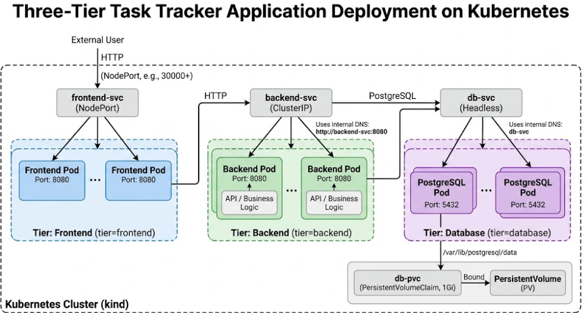

The architecture diagram shows the completed relationship between the frontend, backend, and PostgreSQL database tiers. It also illustrates the Kubernetes Services used for communication and the persistent storage attached to the database tier.

---

# 4. Namespace Configuration

A dedicated Kubernetes namespace named `dso202-assignment-01` was created for the application.

Using a separate namespace provided isolation for all application resources and made it easier to manage and verify the deployment.

**Evidence 2: Namespace Created**

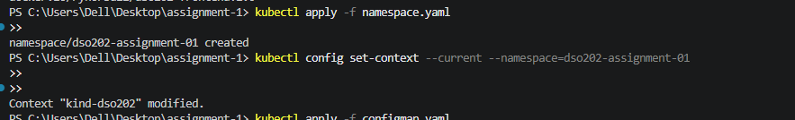

The image shows that the `dso202-assignment-01` namespace was successfully created and is available in the Kubernetes cluster.

---

**Evidence 3: Namespace Verification**

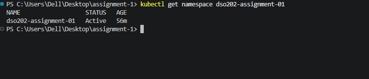

The namespace was verified using Kubernetes commands, confirming that the application resources were being managed within the correct namespace.

---

# 5. Configuration Management

A Kubernetes ConfigMap was created to store non-sensitive application configuration.

The ConfigMap contained configuration values including:

* `DB_HOST=db-svc`
* `DB_PORT=5432`
* `DB_NAME=tasks`
* `APP_PORT=8080`
* `POSTGRES_DB=tasks`
* `BACKEND_URL=http://backend-svc:8080`

The configuration allowed the application components to communicate using Kubernetes Service names rather than hard-coded IP addresses.

## Evidence 4: ConfigMap

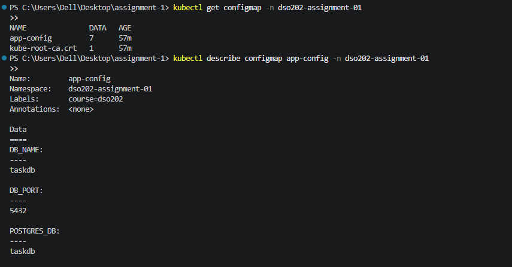

The image shows the successfully created ConfigMap and its application configuration values. The database and backend Service names demonstrate the use of Kubernetes internal DNS for service-to-service communication.

---

# 6. Secret Management

Sensitive database credentials were stored using a Kubernetes Secret rather than placing them directly inside the application manifests.

The Secret contained values for:

* `DB_USER`
* `DB_PASSWORD`
* `POSTGRES_USER`
* `POSTGRES_PASSWORD`

This separated sensitive credentials from normal application configuration.

## Evidence 5: Kubernetes Secret

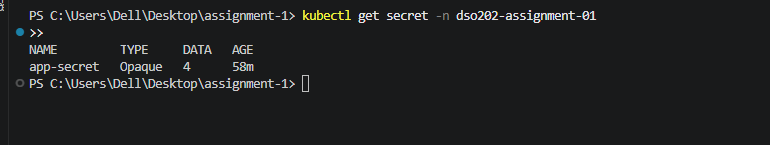

The screenshot confirms that the Kubernetes Secret was successfully created and contains the required database credential keys.

---

# 7. Database Deployment

The PostgreSQL database was deployed as a Kubernetes Deployment.

The database container was configured to use the PostgreSQL image and the database credentials supplied through the Kubernetes Secret.

The database storage was mounted at:

```text
/var/lib/postgresql/data
```

This ensured that PostgreSQL data was stored on persistent Kubernetes storage rather than only inside the temporary container filesystem.

## Evidence 6: Database Pod

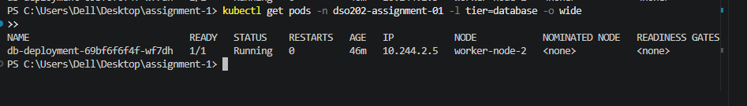

The image shows that the PostgreSQL database Pod was successfully created and reached the Running state.

---

# 8. Persistent Storage

A PersistentVolumeClaim named `db-pvc` was created for the PostgreSQL database.

The PVC requested 1Gi of storage and was mounted into the PostgreSQL container.

This configuration allowed database data to remain available even when the PostgreSQL Pod was recreated.

## Evidence 7: PersistentVolumeClaim

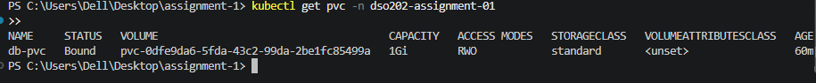

The image shows that `db-pvc` was successfully created and reached the Bound state, providing persistent storage for the PostgreSQL database.

---

# 9. Database Service

A Kubernetes Service named `db-svc` was created to provide stable internal access to PostgreSQL.

The Service was configured as a headless Service using:

```yaml
clusterIP: None
```

This allowed the database to be discovered using the Kubernetes DNS name `db-svc`.

## Evidence 8: Database Service

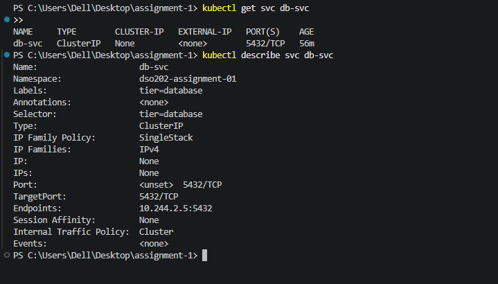

The image shows that `db-svc` was successfully deployed and configured as the internal Service for the PostgreSQL database.

---

# 10. Backend Deployment

The backend application was deployed using a Kubernetes Deployment named `backend-deployment`.

The backend container listens on port `8080` and communicates with PostgreSQL using the `db-svc` Kubernetes Service.

The backend configuration was supplied through the ConfigMap and Secret resources.

## Evidence 9: Backend Pod

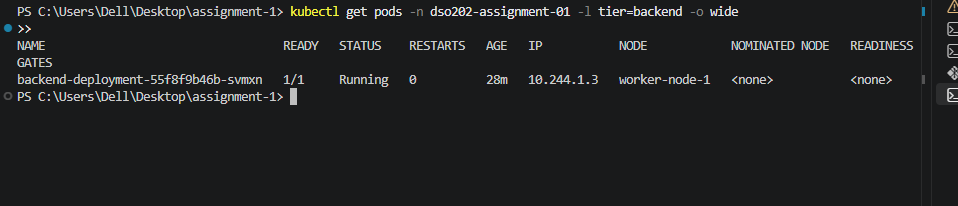

The image shows that the backend Pod was successfully deployed and reached the Running state.

---

# 11. Backend Health Check

The backend API was tested from inside the Kubernetes cluster using a temporary curl Pod.

The following endpoint was successfully accessed:

```text
http://backend-svc:8080/api/status
```

The successful response confirmed that the backend Service was accessible and that the backend application was running correctly.

## Evidence 10: Backend Health Check

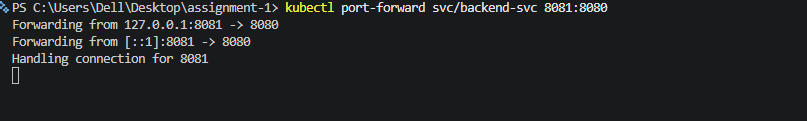

The image shows the successful response from the backend health endpoint, confirming that the backend application was operational.

---

**Evidence 11: Backend Service Verification**

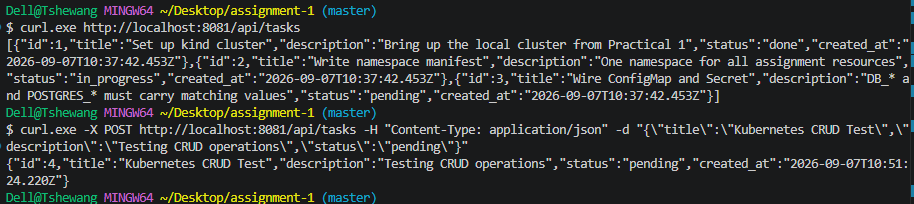

The additional verification confirms that the backend Service correctly routed requests to the running backend Pod.

---

# 12. Frontend Deployment

The frontend application was deployed using `frontend-deployment`.

The frontend was configured to communicate with the backend using:

```text
http://backend-svc:8080
```

This allowed the frontend to communicate with the backend through Kubernetes internal service discovery.

## Evidence 12: Frontend Deployment

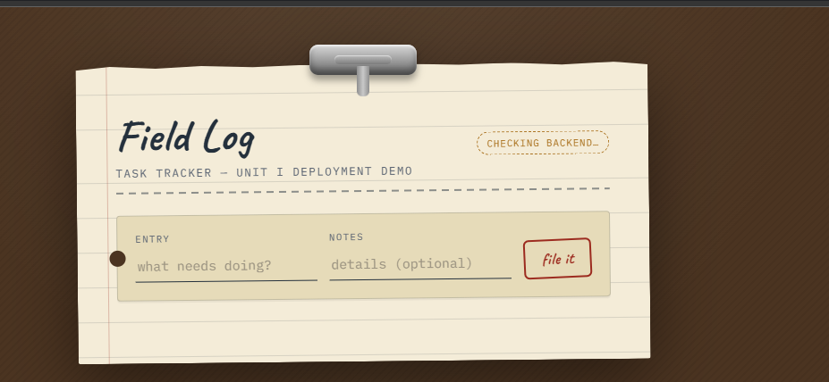

The image shows that the frontend Pod was successfully deployed and running inside the Kubernetes cluster.

---

# 13. Frontend Application Verification

The frontend application was accessed locally using Kubernetes port forwarding.

The following command was used:

```powershell
kubectl port-forward svc/frontend-svc 8080:8080
```

The frontend was successfully accessed through the local forwarded port.

## Evidence 13: Frontend Application

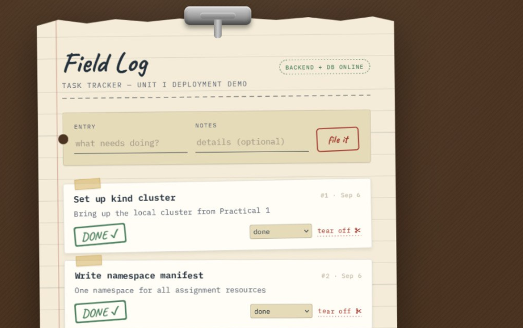

The image shows the successfully running Task Tracker frontend application. The application interface was accessible through the Kubernetes Service and responded correctly to user interaction.

---

# 14. Kubernetes Services

Three Kubernetes Services were deployed to provide communication between the application tiers:

| Service        | Type             | Purpose                                 |
| -------------- | ---------------- | --------------------------------------- |
| `frontend-svc` | NodePort         | Exposes the frontend application        |
| `backend-svc`  | ClusterIP        | Provides internal access to the backend |
| `db-svc`       | Headless Service | Provides internal access to PostgreSQL  |

The Services provided stable networking endpoints for the application components.

## Evidence 14: Kubernetes Services

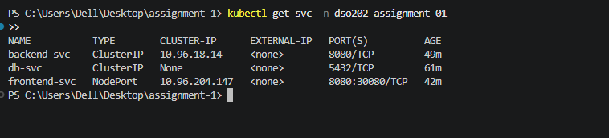

The image showss that the frontend, backend, and database Services were successfully created and are available within the Kubernetes namespace.

---

# 15. Resource Management

Resource management was configured using Kubernetes `ResourceQuota` and `LimitRange`.

The ResourceQuota controlled the total resource consumption within the namespace, while the LimitRange defined default resource requests and limits for Pods and containers.

This ensured that the application operated within controlled resource boundaries.

## Evidence 15: Resource Controls

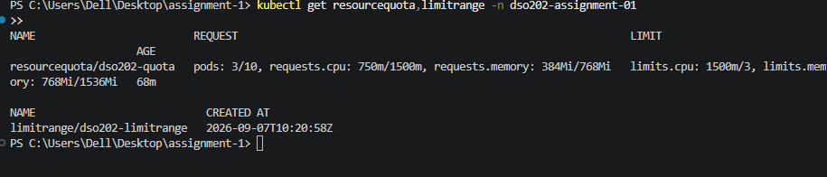

The image shows that the ResourceQuota and LimitRange resources were successfully created and applied to the application namespace.

---

# 16. CRUD Operations

The backend API was tested using CRUD operations.

The backend Service was temporarily exposed locally using:

```powershell
kubectl port-forward svc/backend-svc 8081:8080
```

The following operations were successfully tested:

### Create

A new task was created using the POST endpoint:

```text
POST /api/tasks
```

### Read

The stored tasks were retrieved using:

```text
GET /api/tasks
```

### Update

An existing task was modified using:

```text
PUT /api/tasks/:id
```

### Delete

A task was removed using:

```text
DELETE /api/tasks/:id
```

## Evidence 16: CRUD Operations

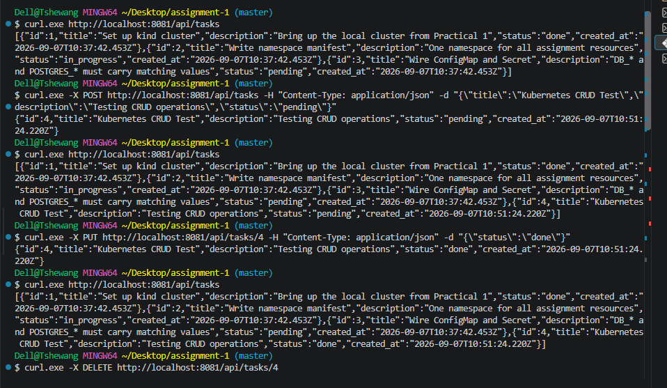

The image shows the successful execution of the Task Tracker CRUD operations. Tasks were created, retrieved, updated, and deleted through the backend API.

---

# 17. Kubernetes Service DNS

Kubernetes internal DNS was tested to confirm communication between the frontend and backend.

A shell was opened inside the frontend Pod and the backend health endpoint was accessed using:

```text
curl http://backend-svc:8080/api/status
```

The successful response confirmed that the frontend Pod could resolve and communicate with the backend using the Kubernetes Service name.

## Evidence 17: Service DNS Verification

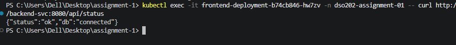

The image shows successful service discovery using the Kubernetes DNS name `backend-svc`. The frontend Pod was able to resolve the backend Service and receive a valid response.

---

# 18. Backend Self-Healing

Kubernetes self-healing was tested by deleting the running backend Pod.

The backend Pod was deleted manually and the Deployment controller automatically created a replacement Pod.

This demonstrated the self-healing capability provided by Kubernetes Deployments.

## Evidence 18: Backend Self-Healing

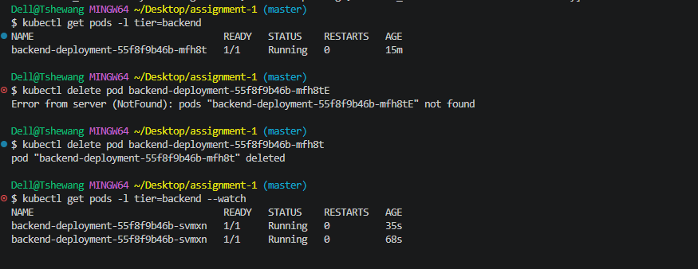

The image shows the original backend Pod being removed and a replacement Pod being automatically created. This confirms that the Kubernetes Deployment maintained the required number of replicas.

---

# 19. Database Persistence

Database persistence was tested by creating a task named:

```text
Persistence Test
```

The PostgreSQL Pod was then deleted.

After Kubernetes recreated the database Pod, the task was retrieved again. The `Persistence Test` task was still available.

This confirmed that the PostgreSQL data was stored on the PersistentVolume rather than only inside the database container.

## Evidence 19: Database Persistence

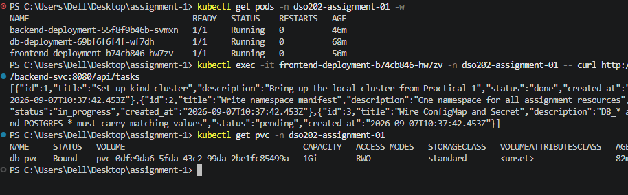

The image shows that the task created before the PostgreSQL Pod restart remained available after the database Pod was recreated. This demonstrates successful persistent storage.

---

# 20. Declarative Resource Management

The Kubernetes resources were managed declaratively using YAML manifest files.

The namespace manifest was applied using:

```powershell
kubectl apply -f namespace.yaml
```

The declarative approach allowed Kubernetes resources to be defined as configuration files and applied consistently.

## Evidence 20: Declarative Management

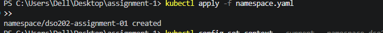

The image shows the successful application of the Kubernetes manifest using `kubectl apply`, confirming declarative resource management.

---

# 21. Imperative Resource Management

Imperative Kubernetes resource management was also demonstrated by creating a temporary namespace directly through the command line.

The namespace was created using:

```powershell
kubectl create namespace dso202-test
```

It was then removed after verification.

## Evidence 21: Imperative Management

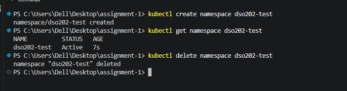

The image shows that the temporary namespace was successfully created using an imperative Kubernetes command and subsequently removed.

---

# 22. Final Deployment Verification

After completing the deployment and testing, the Kubernetes resources were verified using:

```powershell
kubectl get all,pvc,configmap,secret,resourcequota,limitrange -n dso202-assignment-01
```

The final verification confirmed that the required application resources were successfully deployed in the namespace.

## Evidence 22: Final Kubernetes Resources

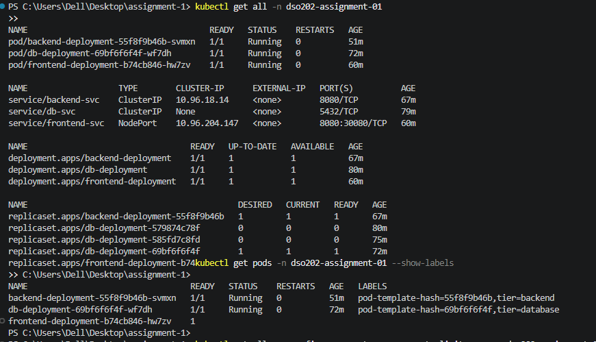

The image provides a final overview of the deployed Kubernetes resources, including Pods, Services, Deployments, and other application resources.

---

**Evidence 23: Final Resource Verification**

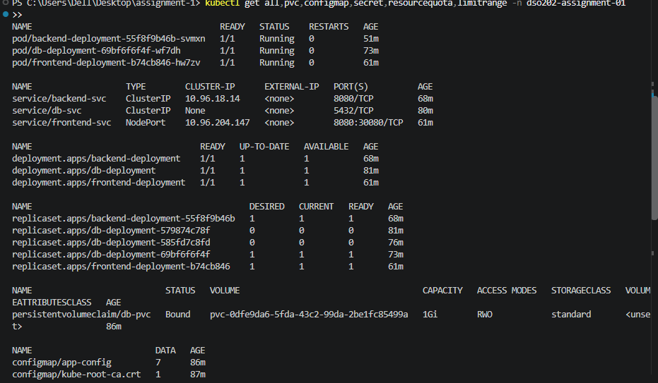

The additional verification confirms that the application components and supporting Kubernetes resources were available and operating within the `dso202-assignment-01` namespace.

---

# 23. Pod Labels

Labels were used to identify the different application tiers.

The deployed Pods were labelled according to their roles:

```text
tier=frontend
tier=backend
tier=database
```

These labels provided a simple way to identify and organize the different components of the application.

## Evidence 24: Pod Labels

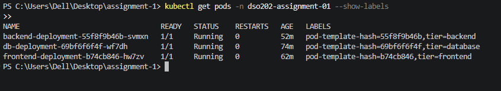

The image confirms that the frontend, backend and database Pods were correctly labelled according to their respective application tiers.

---
## Challenges Faced

| No. | Challenge Faced                                                                                                    | Solution / How It Was Resolved                                                                                                                               |
| --- | ------------------------------------------------------------------------------------------------------------------ | ------------------------------------------------------------------------------------------------------------------------------------------------------------ |
| 1   | Docker images initially had platform compatibility issues when pulling them for the Kubernetes cluster.            | The image configuration and available image versions were checked, and compatible images were used for the kind cluster.                                     |
| 2   | Kubernetes Pods sometimes entered states such as `CrashLoopBackOff` or required troubleshooting during deployment. | `kubectl get pods`, `kubectl describe pod`, and `kubectl logs` were used to identify configuration and connectivity issues.                                  |
| 3   | The frontend could not be accessed directly through the browser using the Kubernetes service initially.            | `kubectl port-forward svc/frontend-svc 8080:8080` was used to access the frontend through `http://localhost:8080`.                                           |
| 4   | Communication between the frontend and backend needed to be verified through Kubernetes networking.                | The backend was exposed using a ClusterIP Service, and DNS resolution was tested using the service name `backend-svc`.                                       |
| 5   | Database connectivity required the correct environment variables and credentials.                                  | ConfigMap and Secret values were configured separately, with matching database settings supplied to both the backend and PostgreSQL containers.              |
| 6   | Understanding the difference between Pod storage and persistent storage was initially challenging.                 | A PersistentVolumeClaim was used for PostgreSQL data, and the database Pod was deleted and recreated to verify that the data remained available.             |
| 7   | Kubernetes resource management using ResourceQuota and LimitRange required careful configuration.                  | Appropriate CPU and memory limits were defined and applied to the namespace to control resource consumption.                                                 |
| 8   | It was necessary to understand the difference between declarative and imperative Kubernetes management.            | The same type of resource was created using both YAML with `kubectl apply` and a direct `kubectl create` command, allowing their differences to be compared. |
| 9   | Verifying that Kubernetes automatically recovered failed Pods required additional testing.                         | The backend Pod was manually deleted and `kubectl get pods --watch` was used to observe Kubernetes creating a replacement Pod.                               |
| 10  | Managing multiple Kubernetes resources and ensuring their labels and configurations were correct was challenging.  | Final verification commands such as `kubectl get all`, `kubectl get pvc`, and resource-specific checks were used to confirm the deployment configuration.    |

### Overall

The main challenges were related to Kubernetes networking, container compatibility, persistent storage, resource management and troubleshooting. Resolving these issues improved my practical understanding of Kubernetes and helped me become more confident in deploying and managing a multi-tier application.


## Reflection

This assignment gave me practical experience in deploying a three-tier application on a Kubernetes cluster using kind. I gained a better understanding of how Kubernetes manages different application components through Deployments, Services, ConfigMaps, Secrets, PersistentVolumeClaims, ResourceQuotas, and LimitRanges.

During the implementation, I learned how the frontend, backend, and PostgreSQL database communicate through Kubernetes Services and how internal DNS allows the backend to be accessed using its service name. I also learned the importance of using ConfigMaps for non-sensitive configuration and Secrets for database credentials instead of storing passwords directly in deployment manifests.

One of the most useful parts of the assignment was testing Kubernetes self-healing and persistent storage. Deleting the backend Pod demonstrated that Kubernetes automatically recreated the Pod, while deleting the database Pod and verifying the previously created task showed that the data remained available through the PersistentVolumeClaim. This helped me understand the difference between Pod lifecycle and persistent application data.

I also experienced some challenges while configuring the cluster, including container image compatibility, service connectivity, port forwarding, and Kubernetes resource configuration. Troubleshooting these issues improved my ability to use commands such as `kubectl get`, `kubectl describe`, `kubectl logs`, `kubectl exec`, and `kubectl port-forward` to identify and resolve deployment problems.

Overall, this assignment improved my understanding of Kubernetes architecture and strengthened my practical skills in deploying, configuring, testing, and troubleshooting containerized applications. It also showed me the advantages of declarative Kubernetes configuration, where the desired infrastructure can be defined in YAML files and reproduced consistently.


# 24. Conclusion

The three-tier Task Tracker application was successfully deployed and tested on a Kubernetes cluster using kind.

The deployment consisted of a frontend, backend API, and PostgreSQL database, with Kubernetes Services providing communication between the different tiers. ConfigMaps and Secrets were used to manage application configuration and database credentials, while a PersistentVolumeClaim provided persistent storage for PostgreSQL.

The completed testing demonstrated several key Kubernetes capabilities. The backend Deployment successfully recovered after its Pod was deleted, demonstrating Kubernetes self-healing. Database persistence was also successfully verified by deleting and recreating the PostgreSQL Pod while retaining previously stored task data.

Kubernetes Service DNS was tested successfully, confirming that application components could communicate using Service names rather than Pod IP addresses. CRUD operations were also successfully performed through the backend API.

ResourceQuota and LimitRange were configured to control resource usage within the namespace. Both declarative and imperative Kubernetes management approaches were demonstrated.

Overall, the assignment successfully demonstrated the deployment and management of a functional three-tier cloud-native application using Kubernetes. The implementation provided practical experience with container orchestration, service discovery, persistent storage, configuration management, secrets, resource control, self-healing, and Kubernetes resource management.
